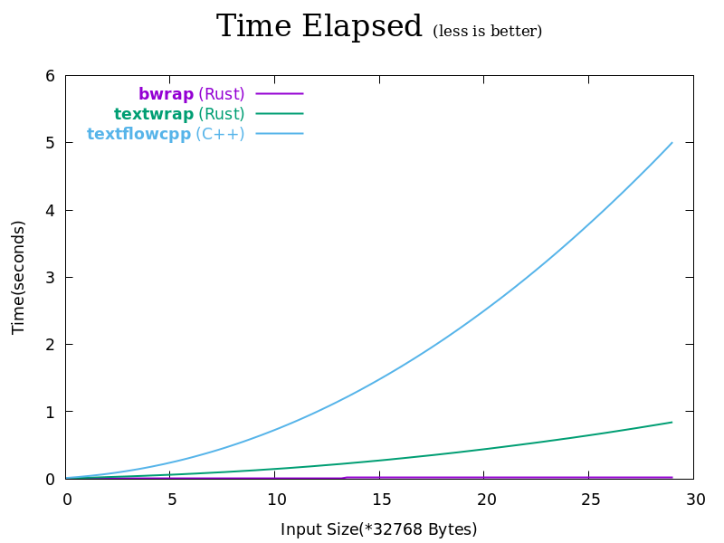
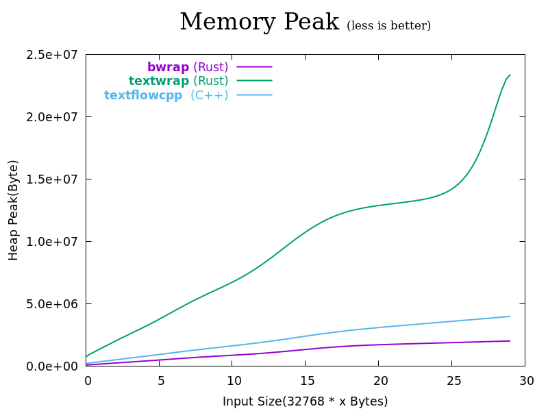

- [About](#orgd104a02)
- [Benchmark](#org4333cde)
- [Features](#orgcec4e85)
- [Examples(`use_std` feature)](#org74a1ddf)
  - [Multiple languages](#orga390d29)
    - [English, Ukrainian, Greek, etc.](#org8691263)
    - [Chinese, Japanese, Thai, etc.](#org282ffa5)
  - [Append/prepend](#orgc597ffa)
    - [Indentation](#org154a065)
    - [Trailing notation](#org78a8e8c)
- [License](#org81f8b0c)


<a id="orgd104a02"></a>

# About

Bwrap is a fast, lightweight, embedded environment-friendly library for wrapping text. While Bwrap offers great flexibility in wrapping text, neither resource consumption nor performance compromises:

1.  No heap allocation happens by default.

2.  The time/space complexity is *O(n)* by default, or *O(n(p+a))* if there is appending/prepending. (*n*, *p*, *a* is the number of input bytes, prepended bytes, and appended bytes respectively)

For the sake of readability, we (**b**)etter **wrap** our text.


<a id="org4333cde"></a>

# Benchmark

Below are the performance comparisons among several text-wrapping libraries in different dimensions:

**Time elapsed:**



**Memory usage:**



Note:

1.  Details about benchmark samples or methods are elaborated in [bench-wrap-libs](https://github.com/micl2e2/bench-wrap-libs).

2.  The data above is recorded on an i5-3337u/12G machine and is for reference only. It is possible to have a slightly different result on a different machine or with different idle system resource.


<a id="orgcec4e85"></a>

# Features

`use_std`: Use Rust standard library(libstd) for automatic memory management.


<a id="org74a1ddf"></a>

# Examples(`use_std` feature)


<a id="orga390d29"></a>

## Multiple languages

Bwrap suuport multiple languages, it categorizes languages into two categories: **space-sensitive** and **space-insensitive**. The former is for the languages that depend on ASCII SPACE to delimit words, such as English, Ukrainian, Greek and so on. The latter is for the languages that are space-insensitive, such as Chinese, Japanese, Thai and so on.


<a id="org8691263"></a>

### English, Ukrainian, Greek, etc.

-   English

    Original:
    
    ```
    one two three four five six seven eight nine ten one two three four five six seven eight nine ten one two three four five six seven eight nine ten
    ```
    
    **Wrapped**:
    
    ```
    one two three four five six seven eight nine ten
    one two three four five six seven eight nine ten
    one two three four five six seven eight nine ten
    ```
    
    Source code:
    
    ```rust
    let line = "one two three four five six seven eight nine ten one two three four five six seven eight nine ten one two three four five six seven eight nine ten";
    println!("ORIGINAL:\n\n{}\n", line);
    println!("WRAPPED:\n\n{}", bwrap::wrap!(line, 50));
    ```

-   Ukrainian

    Original:
    
    ```
    один два три чотири п'ять шість сім вісім дев'ять десять один два три чотири п'ять шість сім вісім дев'ять десять один два три чотири п'ять шість сім вісім дев'ять десять
    ```
    
    **Wrapped**:
    
    ```
    один два три чотири п'ять шість сім вісім дев'ять десять
    один два три чотири п'ять шість сім вісім дев'ять десять
    один два три чотири п'ять шість сім вісім дев'ять десять
    ```
    
    Source code:
    
    ```rust
    let line = "один два три чотири п'ять шість сім вісім дев'ять десять один два три чотири п'ять шість сім вісім дев'ять десять один два три чотири п'ять шість сім вісім дев'ять десять";
    println!("ORIGINAL:\n\n{}\n", line);
    println!("WRAPPED:\n\n{}", bwrap::wrap!(line, 60));
    ```

-   Greek

    Original:
    
    ```
    ένα δύο τρία τέσσερα πέντε έξι επτά οκτώ εννέα δέκα ένα δύο τρία τέσσερα πέντε έξι επτά οκτώ εννέα δέκα ένα δύο τρία τέσσερα πέντε έξι επτά οκτώ εννέα δέκα
    ```
    
    **Wrapped**:
    
    ```
    ένα δύο τρία τέσσερα πέντε έξι επτά οκτώ εννέα δέκα
    ένα δύο τρία τέσσερα πέντε έξι επτά οκτώ εννέα δέκα
    ένα δύο τρία τέσσερα πέντε έξι επτά οκτώ εννέα δέκα
    ```
    
    Source code:
    
    ```rust
    let line = "ένα δύο τρία τέσσερα πέντε έξι επτά οκτώ εννέα δέκα ένα δύο τρία τέσσερα πέντε έξι επτά οκτώ εννέα δέκα ένα δύο τρία τέσσερα πέντε έξι επτά οκτώ εννέα δέκα";
    println!("ORIGINAL:\n\n{}\n", line);
    println!("WRAPPED:\n\n{}", bwrap::wrap!(line, 51));
    ```


<a id="org282ffa5"></a>

### Chinese, Japanese, Thai, etc.

-   Chinese

    Original:
    
    ```
    一二三四五六七八九十一二三四五六七八九十一二三四五六七八九十
    ```
    
    **Wrapped**:
    
    ```
    一二三四五六七八九十
    一二三四五六七八九十
    一二三四五六七八九十
    ```
    
    Source code:
    
    ```rust
    let line = "一二三四五六七八九十一二三四五六七八九十一二三四五六七八九十";
    println!("ORIGINAL:\n\n{}\n", line);
    println!("WRAPPED:\n\n{}", bwrap::wrap_maybrk!(line, 20));
    ```

-   Japanese

    Original:
    
    ```
    ありがとうございますありがとうございますありがとうございます
    ```
    
    **Wrapped**:
    
    ```
    ありがとうございます
    ありがとうございます
    ありがとうございます
    ```
    
    Source code:
    
    ```rust
    let line = "ありがとうございますありがとうございますありがとうございます";
    println!("ORIGINAL:\n\n{}\n", line);
    println!("WRAPPED:\n\n{}", bwrap::wrap_maybrk!(line, 20));
    ```

-   Thai

    Original:
    
    ```
    หนึ่งสองสามสี่ห้าหกเจ็ดแปดเก้าสิบหนึ่งสองสามสี่ห้าหกเจ็ดแปดเก้าสิบหนึ่งสองสามสี่ห้าหกเจ็ดแปดเก้าสิบ
    ```
    
    **Wrapped**:
    
    ```
    หนึ่งสองสามสี่ห้าหกเจ็ดแปดเก้าสิบ
    หนึ่งสองสามสี่ห้าหกเจ็ดแปดเก้าสิบ
    หนึ่งสองสามสี่ห้าหกเจ็ดแปดเก้าสิบ
    ```
    
    Source code:
    
    ```rust
    let line = "หนึ่งสองสามสี่ห้าหกเจ็ดแปดเก้าสิบหนึ่งสองสามสี่ห้าหกเจ็ดแปดเก้าสิบหนึ่งสองสามสี่ห้าหกเจ็ดแปดเก้าสิบ";
    println!("ORIGINAL:\n\n{}\n", line);
    println!("WRAPPED:\n\n{}", bwrap::wrap_maybrk!(line, 25));
    ```


<a id="orgc597ffa"></a>

## Append/prepend

Bwrap can append or prepend whatever string to newly added newline character. With this feature, one can effectively achieve indentation, line trailing notation or similar.


<a id="org154a065"></a>

### Indentation

Original:

```
Here is our schedule:
- Do A, and do B, and do C, and do D, and do E, and do F
- Do G, and do H, and do I, and do J, and do K, and do L
```

**Wrapped**:

```
Here is our schedule:
- Do A, and do B, and do C, and do
  D, and do E, and do F
- Do G, and do H, and do I, and do
  J, and do K, and do L
```

Source code:

```rust
use bwrap::{EasyWrapper, ExistNlPref, WrapStyle::NoBrk};

let line = "Here is our schedule:\n- Do A, and do B, and do C, and do D, and do E, and do F\n- Do G, and do H, and do I, and do J, and do K, and do L";
println!("ORIGINAL:\n\n{}\n", line);
let mut w = EasyWrapper::new(line, 35).unwrap();
let wrapped = w.wrap_use_style(NoBrk(Some("  "), ExistNlPref::KeepTrailSpc)).unwrap();
println!("WRAPPED:\n\n{}", wrapped);
```


<a id="org78a8e8c"></a>

### Trailing notation

Original:

```
VGhpcyBpcyBhIHNlY3JldCBtZXNzYWdlLCBwbGVhc2UgZGVsZXRlIGFmdGVyIHJlYWQK
```

**Wrapped**:

```
VGhpcyBpcy |
BhIHNlY3Jl |
dCBtZXNzYW |
dlLCBwbGVh |
c2UgZGVsZX |
RlIGFmdGVy |
IHJlYWQK  
```

Source code:

```rust
use bwrap::{EasyWrapper, WrapStyle::MayBrk};

let line = "VGhpcyBpcyBhIHNlY3JldCBtZXNzYWdlLCBwbGVhc2UgZGVsZXRlIGFmdGVyIHJlYWQK";
println!("ORIGINAL:\n\n{}\n", line);
let mut w = EasyWrapper::new(line, 10).unwrap();
let wrapped = w.wrap_use_style(MayBrk(Some(" |"), None)).unwrap();
println!("WRAPPED:\n\n{}", wrapped);
```


<a id="org81f8b0c"></a>

# License

Bwrap can be licensed under either [MIT License](https://github.com/micl2e2/bwrap/blob/master/LICENSE-MIT) or [GNU General Public License Version 3.0](https://github.com/micl2e2/bwrap/blob/master/LICENSE-GPL). The choice is up to the recipient.